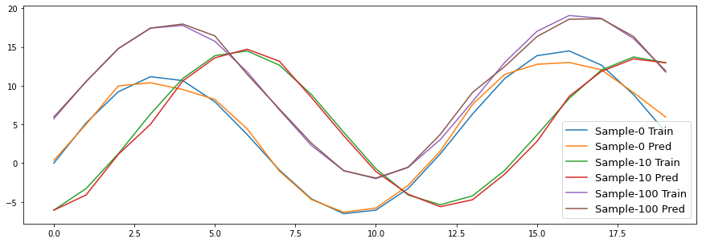
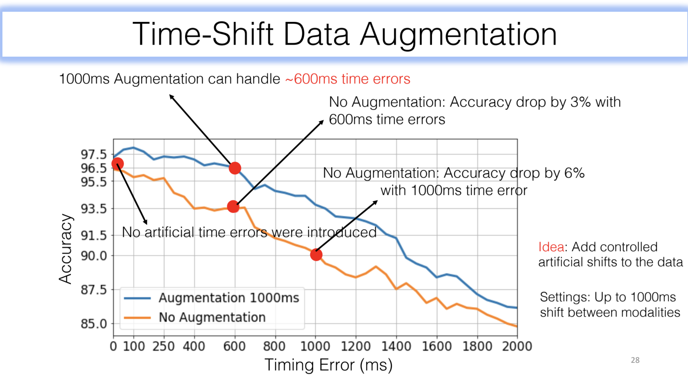

# ML Models on Time Series
A Fun repo maintained to teach ML models on Time Series/sequences.
- Current classifiers in Notebooks: TCN, LSTM, MLP, CNN, Transformers.  
- Hyperparameter tuning showcases using Bayesian Optimization.
- Datasets: Opensource datasets and datasets introduced by my past papers.

## 1. TCN (Temporal Convolutions Network)
We increase the receptive field of convolution layers using dilation. Convolutions don't use the future inputs to make it usable in real-time settings, so it is causal. The folder contains working examples to show this in practice. How to find optimal hyperparameters; I will add a state-of-the-art [Mango](https://github.com/ARM-software/mango) optimizer example for this in the future. Some of hyperparameters used by me are available [here](https://github.com/ARM-software/mango/blob/master/benchmarking/Parameter_Spaces_Evaluated.ipynb). Credits: The TCN implementation in this repo uses [Keras-TCN](https://github.com/philipperemy/keras-tcn) library due to its ease of usage.

### 1.1 [TCN-based Forecasting Notebook](https://github.com/sandeep-iitr/ML_Models_on_Time_Series/blob/main/TCN/TCN_Forecasting.ipynb) 

### 1.2 [TCN and CNN for Human Activity Recognition Notebook](https://github.com/sandeep-iitr/ML_Models_on_Time_Series/blob/main/TCN/TCN_Human_Activity_UCI.ipynb)
An example to show training of human activity models using the intertial sensors. The provided notebook shows comparisons of CNNs and TCN models with TCN model having as low as 10k parameters. 

## 2. LSTM (Long Short-term Memory)
Some examples of LSTM's training on the inertial/time-series datasets. Training deeper LSTM's is slow, and may take a long time due to their hidden-state nature. 

### 2.1 [LSTM for Human Activity Recognition Notebook](https://github.com/sandeep-iitr/ML_Models_on_Time_Series/blob/main/LSTM/LSTM_Human_Activity_UCI.ipynb)
This is a simpler notebook with an easy to understand process. 
More complex notebooks with state-of-the-art reported results using richer data augmentations are available from my paper [codes](https://github.com/nesl/Robust-Deep-Learning-Pipeline).

### 2.2 [LSTM for Predicting next Word](https://github.com/sandeep-iitr/ML_Models_on_Time_Series/blob/main/RNN/RNN_Quick_start.ipynb)
LSTM predicting next word in a sequence. Trained on patents datasets. Credits: Based on the [github repo](https://github.com/WillKoehrsen/recurrent-neural-networks).

## 3. [Time-Series Encoder-Decoder](https://github.com/sandeep-iitr/ML_Models_on_Time_Series/tree/main/CNN)
A few encoder-decoder architectures for time-series.

## 4. [Fusion of Modalities](https://github.com/sandeep-iitr/ML_Models_on_Time_Series/tree/main/Fushion)
Here, I will introduce the fushion of different sensing modalities to achieve higher performance.
In cases, where we have access to multiple sensors observing the same event/activity/phenomenon, fusion often
helps to improve overall appications
- Sensors can compliment each other. 
- Each sensor have different cost, so they can replace each other.

We will start with simple examples, however, in real deployments fusion is challenging. In my papers, we show fusing modalities 
depends a lot of timing behavior of sensors.

